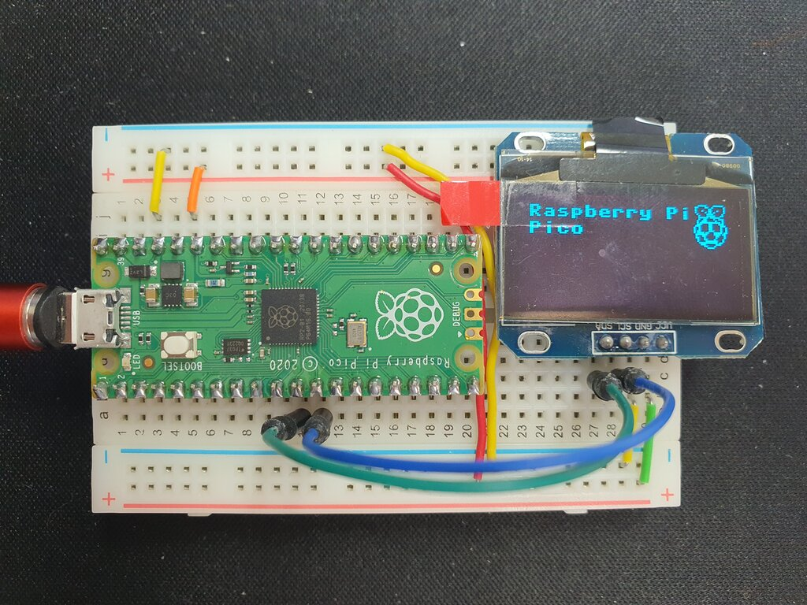
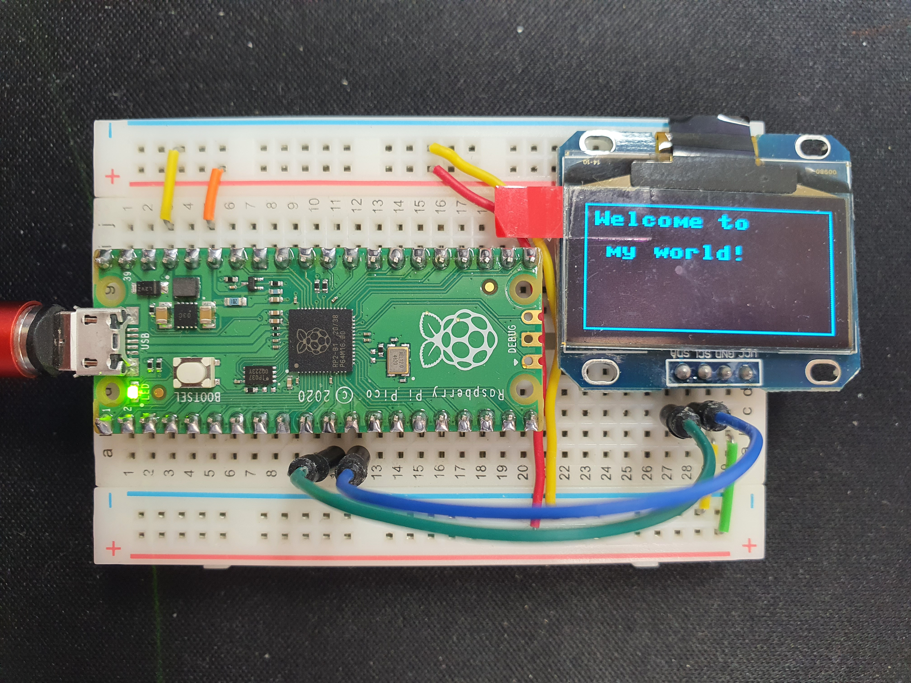

# OLED 예제

1. Pin map
   * 내장 LED Pin: GP25

   PICO | OLED
   -----|-----
   3.3v OUT | Vcc
   GND | GND
   I2C0 SCL (GP9) | SCL 
   I2C0 SDA (GP8) | SDA

2. Driver file
   * /lib/sh1106.py

3. 예제 파일
   1. oled_raspipico_logo_sh1106.py
      

   2. oled_welcome_sh1106.py
      * 참조: https://www.tomshardware.com/how-to/oled-display-raspberry-pi-pico
      
