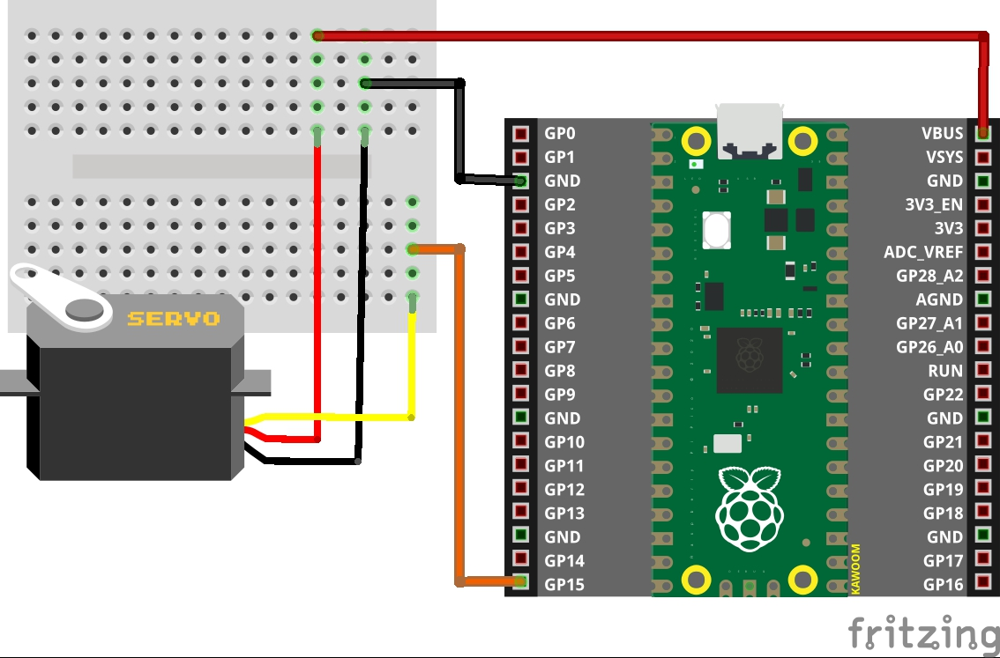

# 서보 모터 예제

## Pin map

PICO | SERVO | 비고
-----|-------|-----
VBUS | 적색 | 5V
GND | 갈색 | GND
GP15 | 주황색 | Data

## Fritzing

## Datasheet

## Driver file
* /lib/pico_servo.py
   
## 예제 파일
* PWM: PWM.duty_ns() 사용
  1. servo_dutyns_test1.py
  2. servo_dutyns_test2.py

* Servo 클래스 (/lib/pico_servo.py)
  1. servo_test1.py
     * Servo.goto()로 0~1024 사이의 값으로 서보 모터 각도 조정
  2. servo_test2.py
     * Servo.angleCcw()로 0도~180도 사이의 값으로 서보 모터 각도 조정
  3. servo_test.py (← 추천 소스)
     * Servo.angleCcw()로 0도~180도 사이의 값으로 서보 모터 각도 조정
     * 배포시 'servo_test.py'를 사용하면 괜찮겠음
     <pre><code>import utime
     from pico_servo import Servo

     # 원 소스의 값 범위: minVal=2500, maxVal=7500
     servo = Servo(15, minVal=2000, maxVal=8200)    # initialize servo on GPIO pin 15

     angles = [0, 90, 180, 90]

     try:
         while True:
             # 서보 모터 각도를 0 -> 90 -> 180 -> 90 -> 0 -> 90 -> ... 와 같이 순환해서 구동
             for angle in angles:
                 servo.angleCcw(angle)
                 utime.sleep(1)
     except:
         pass

     servo.free()    # 서보 모터 각도 0도
     </code></pre>

## 데이터시트상 동작 정리
### MicroServo 9G SG90
* 50Hz(20ms) PWM 구간에서 1~2ms 구간의 신호로 각도 조정
  1. 가동 전압: 4.0V ~ 7.2V (3.0V라는 데이터시트도 있음)
  2. 운전 속도: 부하없는 4.8V에서 0.1~0.12sec/60degrees
  3. Stall torque: 1.2kg (4.8V), 1.6kg (6.0V)
     * Stall torque (스톨토크): 모터에 가한 부하로 인해 회전수가 0이 될때의 힘을 가리킴
  4. 0 위치(1.5ms 펄스)는 중간, 90(2ms 펄스)은 우측 끝, -90(1.0ms 펄스)는 좌측 끝

### 데이터시트와 다른 사항
* 데이터시트상에는 서보 모터의 각도는 1.0ms ~ 2.0ms일 때 0도~180도 각도가 나오는 것 같이 되어 있음
* 실제 테스트해 보면 0.5ms ~ 2.5ms 범위가 0도~180도임
* Thonny의 Lib와 Plugin을 찾아봐도 PWM 관련 함수는 안 보임
* Pico PWM의 동작 함수는 PWM.duty_u16()과 PWM.duty_ns() 뿐인 것으로 유추됨
* PICO로 구현한 대부분 사이트들의 샘플을 동작시켜 보면 0~180도 범위가 안 나옴
* 그나마 괜찮은 예제를 보인 https://github.com/sandbo00/picoservo 에서도 온전한 180도가 안 나와서 범위를 다르게 주었고, 각도로도 되게 추가했음
